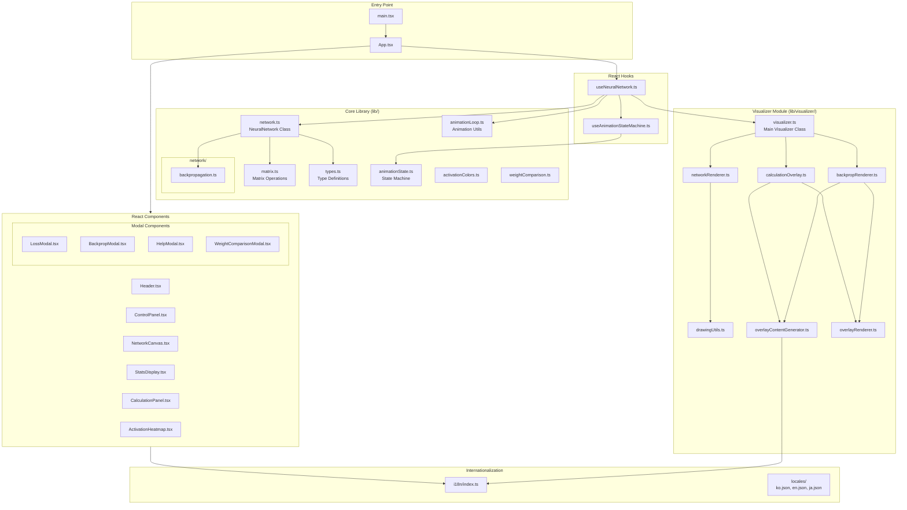
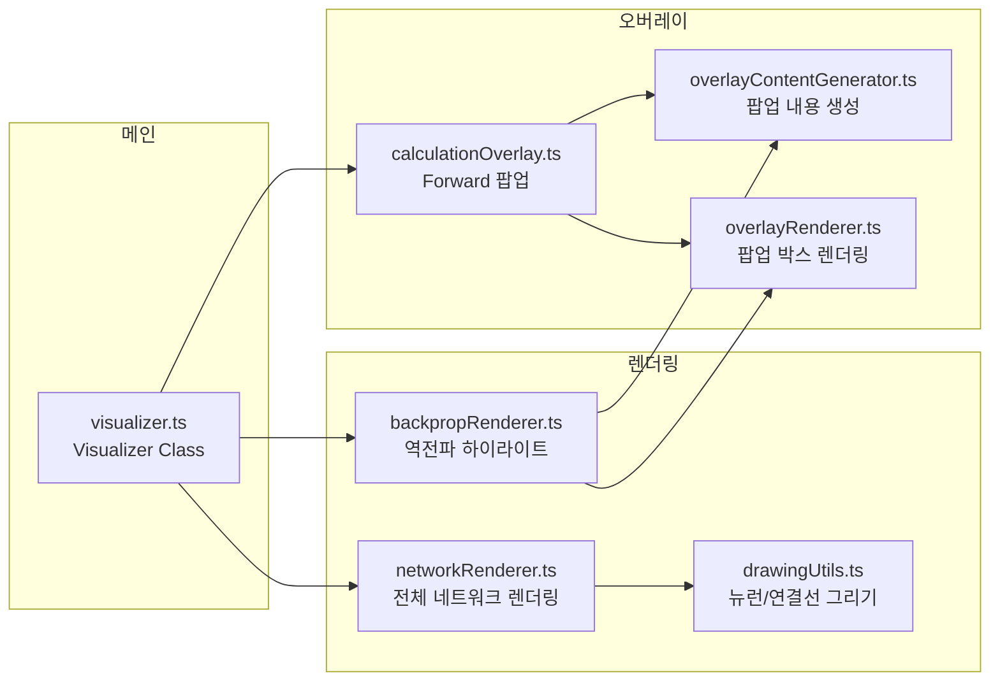
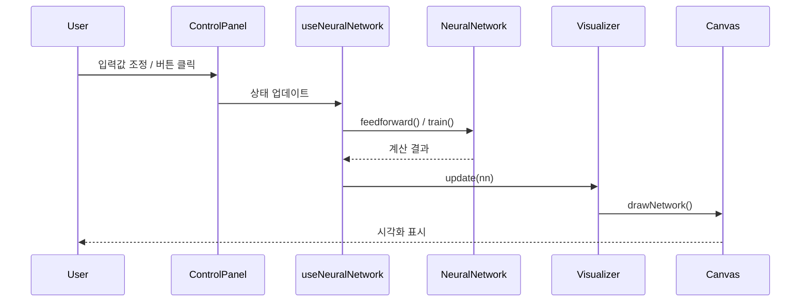
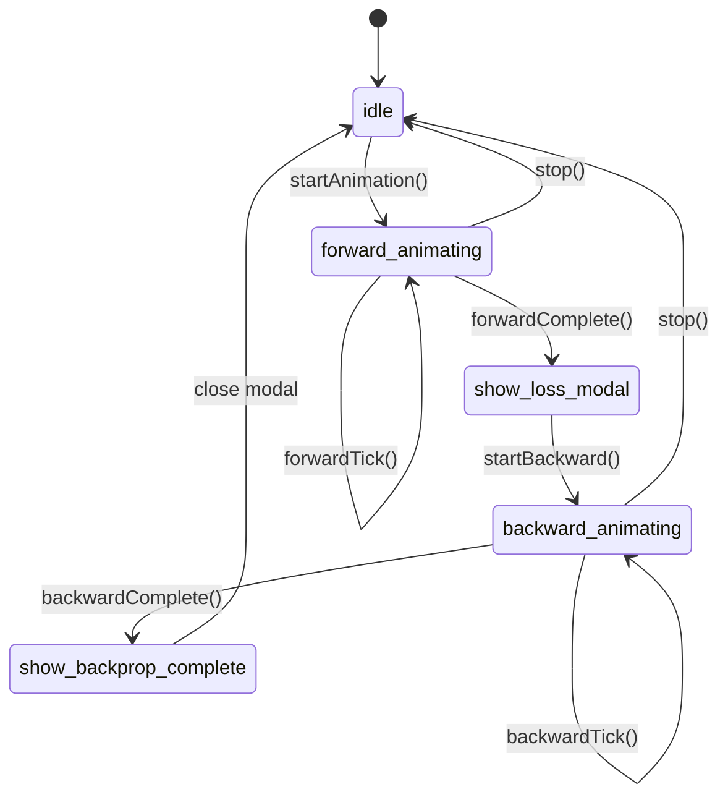

# Neural Network Visualization - Code Architecture

## 전체 구조 다이어그램

---

## 모듈별 책임

### 🎯 Entry & App
| 파일 | 책임 |
|------|------|
| `main.tsx` | React 앱 진입점, 테마 적용 |
| `App.tsx` | 메인 레이아웃, 컴포넌트 조합 |

---

### 🧩 Components
| 컴포넌트 | 책임 |
|----------|------|
| `Header` | 제목, 도움말 버튼 |
| `ControlPanel` | 입력 슬라이더, 학습 버튼 |
| `NetworkCanvas` | 신경망 시각화 캔버스 |
| `StatsDisplay` | 에포크, 손실, 예측 표시 |
| `CalculationPanel` | 연산 과정 텍스트 표시 |
| `ActivationHeatmap` | 레이어별 활성화 히트맵 |
| `LossModal` | Forward Pass 결과, Loss 계산 표시 |
| `BackpropModal` | 역전파 완료 요약 |
| `HelpModal` | 사용법 안내 |
| `WeightComparisonModal` | 학습 전후 가중치 비교 |

---

### 🪝 Hooks
| Hook | 책임 |
|------|------|
| `useNeuralNetwork` | 신경망 생성, 학습, 애니메이션 로직 총괄 |
| `useAnimationStateMachine` | Forward/Backward 애니메이션 상태 관리 |

---

### 🧠 Core Library

#### Network
| 파일 | 책임 |
|------|------|
| `network.ts` | NeuralNetwork 클래스 (feedforward, train, getCalculationSteps) |
| `network/backpropagation.ts` | 역전파 계산 로직 (createBackpropSteps) |
| `matrix.ts` | 행렬 연산 (Matrix 클래스) |
| `types.ts` | 모든 타입 정의 |

#### Animation
| 파일 | 책임 |
|------|------|
| `animationState.ts` | 애니메이션 상태 머신 (idle, forward_animating, backward_animating, etc.) |
| `animationLoop.ts` | 공통 애니메이션 루프 유틸리티 |

#### Utils
| 파일 | 책임 |
|------|------|
| `activationColors.ts` | 활성화값 → 색상 변환 |
| `weightComparison.ts` | 가중치 변화량 계산 |

---

### 🎨 Visualizer Module

---

### 🌐 Internationalization
| 파일 | 책임 |
|------|------|
| `i18n/index.ts` | i18next 설정 |
| `locales/ko.json` | 한국어 번역 |
| `locales/en.json` | 영어 번역 |
| `locales/ja.json` | 일본어 번역 |

---

## 데이터 흐름

---

## 애니메이션 상태 흐름

