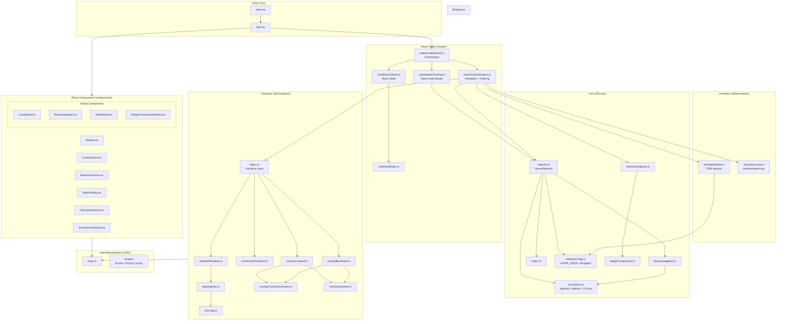
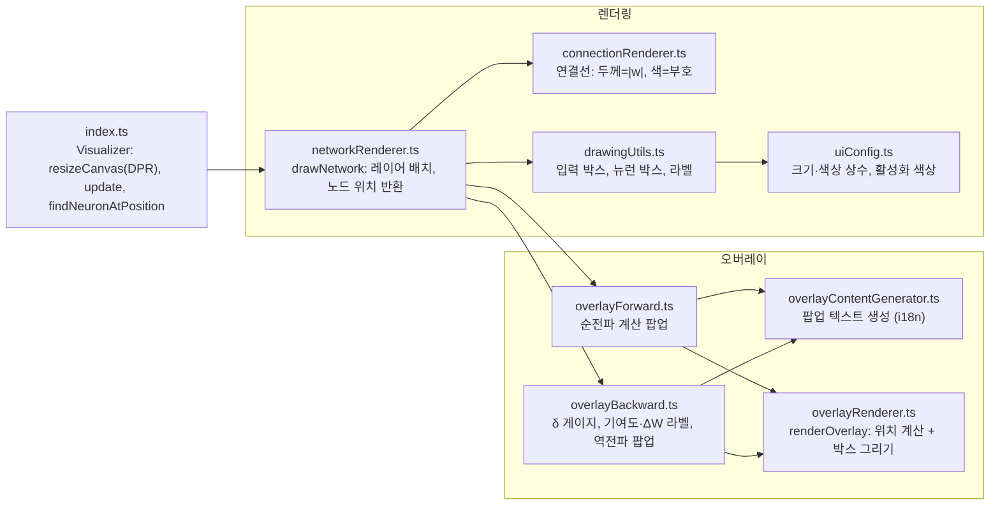
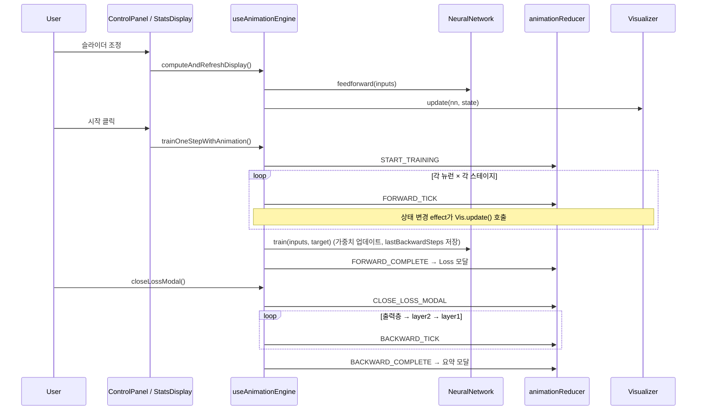
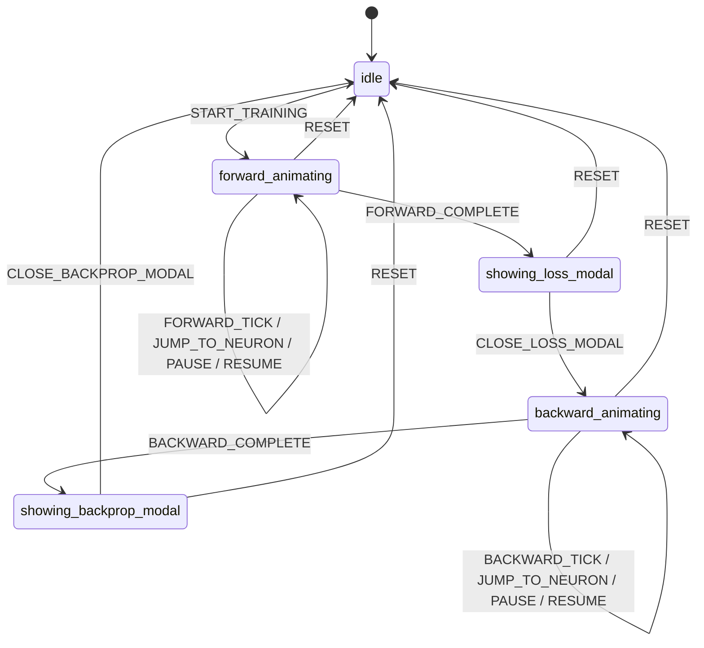

# Neural Network Visualization - Code Architecture

## 전체 구조 다이어그램

```mermaid
flowchart TB
    subgraph Entry["Entry Point"]
        main["main.tsx"]
        App["App.tsx"]
    end

    subgraph Components["React Components (components/)"]
        Header["Header.tsx"]
        ControlPanel["ControlPanel.tsx"]
        NetworkCanvas["NetworkCanvas.tsx"]
        StatsDisplay["StatsDisplay.tsx"]
        CalcPanel["CalculationPanel.tsx"]
        Heatmap["ActivationHeatmap.tsx"]

        subgraph Modals["Modal Components"]
            LossModal["LossModal.tsx"]
            BackpropModal["BackpropModal.tsx"]
            HelpModal["HelpModal.tsx"]
            WeightModal["WeightComparisonModal.tsx"]
        end
    end

    subgraph Hooks["React Hooks (hooks/)"]
        useNN["useNeuralNetwork.ts<br/>Orchestrator"]
        useNS["useNetworkState.ts<br/>React State"]
        useAE["useAnimationEngine.ts<br/>Animation + Training"]
        useModal["useModalState.ts"]
        useDT["useDatasetTraining.ts<br/>Data mode stream"]
    end

    subgraph Core["Core (lib/core/)"]
        Network["network.ts<br/>NeuralNetwork"]
        Backprop["backpropagation.ts"]
        Activations["activations.ts<br/>sigmoid / softmax / CE loss"]
        Matrix["matrix.ts"]
        Config["networkConfig.ts<br/>LAYER_SIZES, navigation"]
        Snapshot["networkSnapshot.ts"]
        WeightComp["weightComparison.ts"]
    end

    subgraph Animation["Animation (lib/animation/)"]
        AnimState["animationState.ts<br/>FSM reducer"]
        AnimLoop["animationLoop.ts<br/>runAnimationLoop"]
    end

    subgraph Visualizer["Visualizer (lib/visualizer/)"]
        VisMain["index.ts<br/>Visualizer class"]
        NetRenderer["networkRenderer.ts"]
        ConnRenderer["connectionRenderer.ts"]
        DrawUtils["drawingUtils.ts"]
        OverlayF["overlayForward.ts"]
        OverlayB["overlayBackward.ts"]
        OverlayContent["overlayContentGenerator.ts"]
        OverlayRenderer["overlayRenderer.ts"]
        UiConfig["uiConfig.ts"]
    end

    Types["lib/types.ts"]

    subgraph I18n["Internationalization (i18n/)"]
        i18nIndex["index.ts"]
        Locales["locales/<br/>en.json, ko.json, ja.json"]
    end

    main --> App
    App --> Components
    App --> useNN

    useNN --> useNS
    useNN --> useAE
    useNN --> useDT
    useDT --> Network
    useNS --> useModal
    useAE --> Network
    useAE --> Snapshot
    useAE --> AnimState
    useAE --> AnimLoop
    useAE --> VisMain

    Network --> Matrix
    Network --> Activations
    Network --> Backprop
    Network --> Config
    Backprop --> Activations
    Snapshot --> WeightComp
    AnimState --> Config

    VisMain --> NetRenderer
    VisMain --> ConnRenderer
    VisMain --> OverlayF
    VisMain --> OverlayB
    NetRenderer --> DrawUtils
    OverlayF --> OverlayContent
    OverlayF --> OverlayRenderer
    OverlayB --> OverlayContent
    OverlayB --> OverlayRenderer
    DrawUtils --> UiConfig

    Components --> i18nIndex
    Visualizer --> i18nIndex
```

`lib/core`는 React와 i18n에 의존하지 않는 순수 TypeScript이며, `src/lib/core/__tests__`와 `src/lib/animation/__tests__`에서 vitest로 검증합니다.

---

## 모듈별 책임

### 🎯 Entry & App
| 파일 | 책임 |
|------|------|
| `main.tsx` | React 앱 진입점, MUI 테마 적용, i18n 초기화 |
| `App.tsx` | 레이아웃, `useNeuralNetwork` 결과를 컴포넌트에 배선 |

---

### 🧩 Components
| 컴포넌트 | 책임 |
|----------|------|
| `Header` | 제목, 언어 전환, 데이터 학습 모드 스위치, 도움말 버튼 (`Footer`도 포함) |
| `ControlPanel` | 입력/타깃/속도 슬라이더, 시작·일시정지·재개, 리셋 |
| `NetworkCanvas` | 캔버스 마운트, DPR 대응 리사이즈, 클릭 좌표 전달, 연결선 범례 |
| `StatsDisplay` | 에포크, 손실, 예측, 학습률, 1회 학습·자동 학습 버튼 |
| `LossChart` | 에포크별 손실 꺾은선(SVG), 호버 툴팁 |
| `CalculationPanel` | 순전파 계산 과정 텍스트, 가중치 비교 열기 버튼 |
| `ActivationHeatmap` | 레이어별 활성화 히트맵 |
| `DataStreamPanel` | 데이터 학습 모드: 지원자 500명 리스트, 재생/일시정지/한 명씩/속도, 학습 전 예측 정답률과 전체 정확도 |
| `LossModal` | 순전파 결과와 Cross-Entropy 손실 설명 |
| `BackpropModal` | 역전파 완료 요약 (수식, 변화량) |
| `WeightComparisonModal` | 학습 전후 가중치 표 비교 |
| `HelpModal` | 사용법 안내 |

---

### 🪝 Hooks
| Hook | 책임 |
|------|------|
| `useNeuralNetwork` | `NeuralNetwork`/`Visualizer` ref 보유, 아래 두 훅을 조합해 그룹화된 API 반환 |
| `useNetworkState` | 모든 React 상태 (입력, 통계, 학습 플래그, 히트맵 데이터, 모달) |
| `useAnimationEngine` | FSM(`useReducer`), 애니메이션 루프, 슬라이더 지원자 학습 제어, 모달 전이, 캔버스 클릭 처리 |
| `useDatasetTraining` | 데이터 학습 모드: 생성된 500명을 예측 → 학습 → 캔버스 갱신 순으로 스트리밍, 패스/정확도 추적 |
| `useModalState` | `show`/`data`/`open`/`close`/`setData`를 갖는 범용 모달 훅 |

자세한 내용은 [hook_architecture.md](hook_architecture.md) 참고.

---

### 🧠 Core (`lib/core/`)
| 파일 | 책임 |
|------|------|
| `network.ts` | `NeuralNetwork` 클래스. `feedforward`, `predict`(상태 변경 없음), `train`, `trainBatch`(1 에포크), `getForwardSteps`, `lastBackwardSteps` |
| `backpropagation.ts` | 출력층(softmax+CE)·은닉층(sigmoid) 역전파, 시각화용 `createBackwardSteps` |
| `activations.ts` | `sigmoid`, `dsigmoid`, `softmax`, `crossEntropyLoss` |
| `matrix.ts` | `Matrix` 클래스 (곱, 전치, 요소 연산, `clone`) |
| `networkConfig.ts` | `LAYER_NAMES`, `LAYER_SIZES`, 뉴런/스테이지 탐색 함수, `toOneHot` |
| `dataset.ts` | 시드 고정 생성기 `generateDataset`(500명, 숨은 규칙 `labelCandidate`, 클래스 균형·셔플). 층화 샘플: 합은 같고 라벨이 다른 대조 쌍 30%, 태도 하한에 걸리는 보류 15%, 나머지 무작위. `evaluateDataset`(정확도·평균 손실) |
| `networkSnapshot.ts` | 가중치 스냅샷과 학습 전후 비교 (`createSnapshot`, `compareSnapshots`) |
| `weightComparison.ts` | 비교 데이터·역전파 요약 데이터 생성 |
| `index.ts` | 공개 API 재export |

### 🎞️ Animation (`lib/animation/`)
| 파일 | 책임 |
|------|------|
| `animationState.ts` | 애니메이션 FSM (`AnimationState`, `AnimationAction`, `animationReducer`, 헬퍼) |
| `animationLoop.ts` | 레이어 → 뉴런 → 스테이지 순회 `runAnimationLoop`, 스테이지별 지속 시간 |

### 📐 Types (`lib/types.ts`)
`ForwardCalculation`, `BackwardCalculation`, `ForwardSteps`, `BackwardSteps`, `NodePosition`, `Viewport`, 비교/요약 데이터 타입.

---

### 🎨 Visualizer (`lib/visualizer/`)

```mermaid
flowchart LR
    Vis["index.ts<br/>Visualizer: resizeCanvas(DPR), update, findNeuronAtPosition"]

    subgraph Rendering["렌더링"]
        Net["networkRenderer.ts<br/>drawNetwork: 레이어 배치, 노드 위치 반환"]
        Conn["connectionRenderer.ts<br/>연결선: 두께=|w|, 색=부호"]
        Draw["drawingUtils.ts<br/>입력 박스, 뉴런 박스, 라벨"]
        Ui["uiConfig.ts<br/>크기·색상 상수, 활성화 색상"]
    end

    subgraph Overlay["오버레이"]
        F["overlayForward.ts<br/>순전파 계산 팝업"]
        B["overlayBackward.ts<br/>δ 게이지, 기여도·ΔW 라벨, 역전파 팝업"]
        Content["overlayContentGenerator.ts<br/>팝업 텍스트 생성 (i18n)"]
        Render["overlayRenderer.ts<br/>renderOverlay: 위치 계산 + 박스 그리기"]
    end

    Vis --> Net
    Net --> Conn
    Net --> Draw
    Net --> F
    Net --> B
    Draw --> Ui
    F --> Content
    F --> Render
    B --> Content
    B --> Render
```

모든 그리기는 CSS 픽셀(논리 좌표)로 이루어지며, `Visualizer.resizeCanvas()`가 `devicePixelRatio`를 `ctx.setTransform`으로 적용합니다. `drawNetwork`가 반환한 노드 위치는 클릭 판정(`findNeuronAtPosition`)에 재사용됩니다.

---

### 🌐 Internationalization
| 파일 | 책임 |
|------|------|
| `i18n/index.ts` | i18next 설정 (기본 언어 `en`) |
| `locales/en.json`, `ko.json`, `ja.json` | 번역. 세 파일은 동일한 키 집합을 가져야 합니다 |

---

## 데이터 흐름

```mermaid
sequenceDiagram
    participant User
    participant UI as ControlPanel / StatsDisplay
    participant Engine as useAnimationEngine
    participant NN as NeuralNetwork
    participant FSM as animationReducer
    participant Vis as Visualizer

    User->>UI: 슬라이더 조정
    UI->>Engine: computeAndRefreshDisplay()
    Engine->>NN: feedforward(inputs)
    Engine->>Vis: update(nn, state)

    User->>UI: 시작 클릭
    UI->>Engine: trainOneStepWithAnimation()
    Engine->>FSM: START_TRAINING
    loop 각 뉴런 × 각 스테이지
        Engine->>FSM: FORWARD_TICK
        Note over Engine,Vis: 상태 변경 effect가 Vis.update() 호출
    end
    Engine->>NN: train(inputs, target)  (가중치 업데이트, lastBackwardSteps 저장)
    Engine->>FSM: FORWARD_COMPLETE → Loss 모달

    User->>Engine: closeLossModal()
    Engine->>FSM: CLOSE_LOSS_MODAL
    loop 출력층 → layer2 → layer1
        Engine->>FSM: BACKWARD_TICK
    end
    Engine->>FSM: BACKWARD_COMPLETE → 요약 모달
```

---

## 애니메이션 상태 흐름

```mermaid
stateDiagram-v2
    [*] --> idle

    idle --> forward_animating: START_TRAINING
    forward_animating --> forward_animating: FORWARD_TICK / JUMP_TO_NEURON / PAUSE / RESUME
    forward_animating --> showing_loss_modal: FORWARD_COMPLETE

    showing_loss_modal --> backward_animating: CLOSE_LOSS_MODAL
    backward_animating --> backward_animating: BACKWARD_TICK / JUMP_TO_NEURON / PAUSE / RESUME
    backward_animating --> showing_backprop_modal: BACKWARD_COMPLETE

    showing_backprop_modal --> idle: CLOSE_BACKPROP_MODAL

    forward_animating --> idle: RESET
    backward_animating --> idle: RESET
    showing_loss_modal --> idle: RESET
    showing_backprop_modal --> idle: RESET
```

`interruptReason`(`none` / `paused` / `jumped`)은 상태 타입과 별개로 유지되어, 실행 중인 비동기 루프가 `shouldStop()`으로 중단 여부를 확인합니다.

---

## 수식 요약

| 층 | 활성화 | 오류(error) | δ | 업데이트 |
|----|--------|-------------|---|----------|
| 출력 | softmax | `target − output` | `error` (CE 손실의 도함수에 이미 포함) | `W += lr · δ · xᵀ`, `b += lr · δ` |
| 은닉 | sigmoid | `Σ δ_next · w` (업데이트 전 가중치) | `error · y(1−y)` | 동일 |

손실은 `L = −Σ tᵢ log pᵢ` (Cross-Entropy). 모든 δ를 먼저 계산한 뒤 가중치를 한 번에 업데이트합니다. 이 수식은 `network.test.ts`의 수치 미분 검사로 검증됩니다.
