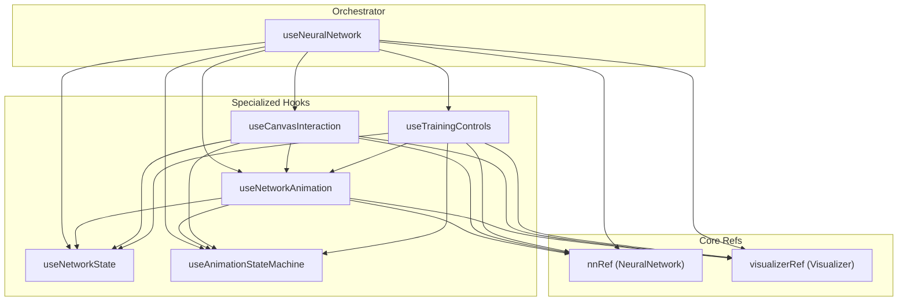
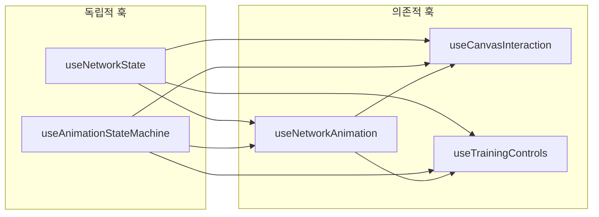
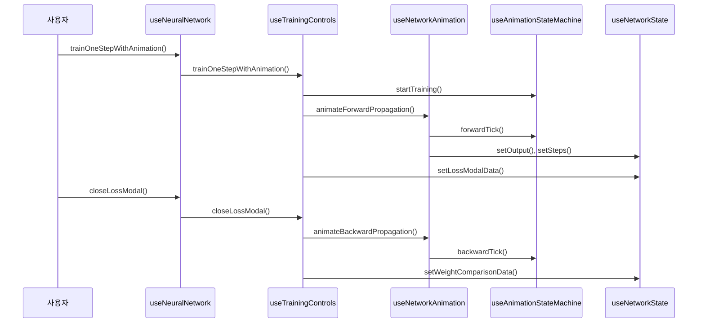

# useNeuralNetwork Hook 리팩토링 Walkthrough

## 훅 관계도



## 훅별 의존성 다이어그램



## 각 훅의 책임

| 훅 | 책임 | 의존성 |
|---|---|---|
| [useNetworkState](file:///c:/src/nn-book/src/hooks/useNetworkState.ts) | 모든 React 상태 관리 | 없음 (독립적) |
| [useAnimationStateMachine](file:///c:/src/nn-book/src/hooks/useAnimationStateMachine.ts) | 애니메이션 상태 전이 | 없음 (독립적) |
| [useNetworkAnimation](file:///c:/src/nn-book/src/hooks/useNetworkAnimation.ts) | Forward/Backward 애니메이션 | nnRef, visRef, state, animationMachine |
| [useCanvasInteraction](file:///c:/src/nn-book/src/hooks/useCanvasInteraction.ts) | 캔버스 클릭 핸들링 | nnRef, visRef, state, animationMachine, animation |
| [useTrainingControls](file:///c:/src/nn-book/src/hooks/useTrainingControls.ts) | 학습 제어, 모달 관리 | nnRef, visRef, state, animationMachine, animation |
| [useNeuralNetwork](file:///c:/src/nn-book/src/hooks/useNeuralNetwork.ts) | 통합 인터페이스 제공 | 모든 훅 |

## 데이터 흐름



---

## Bug Fixed: Maximum Update Depth Exceeded

### 문제 원인
훅에서 반환하는 객체가 매 렌더링마다 새로 생성되어 의존성 배열에 포함 시 무한 루프 발생

### 해결 방법
```diff
- }, [state.animationSpeed, animationMachine]);
+ // eslint-disable-next-line react-hooks/exhaustive-deps
+ }, [state.animationSpeed]);
```

## 검증 결과

