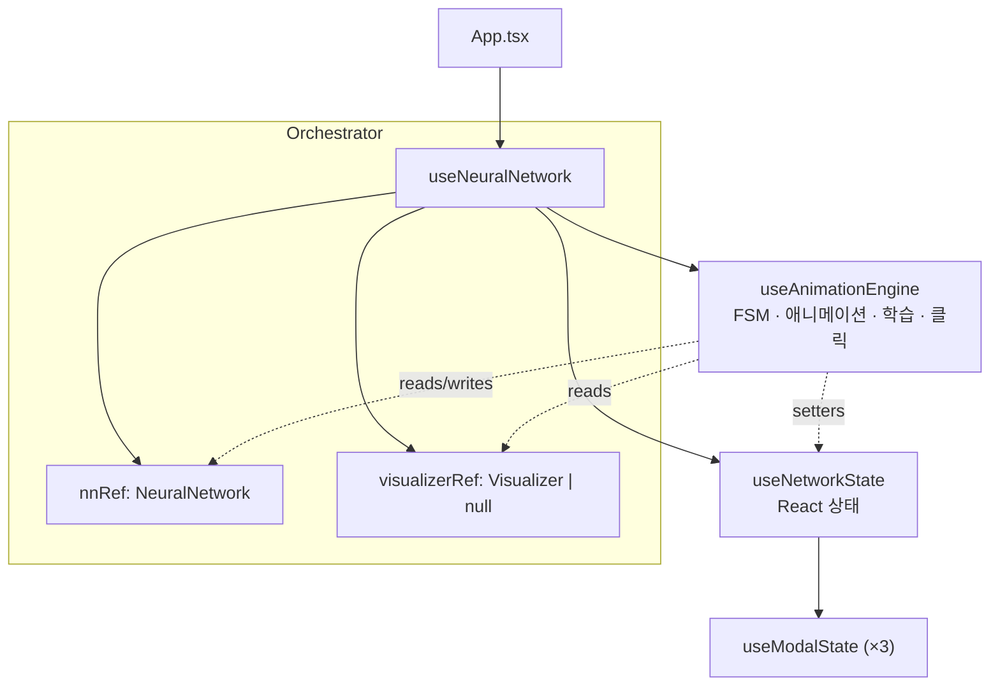
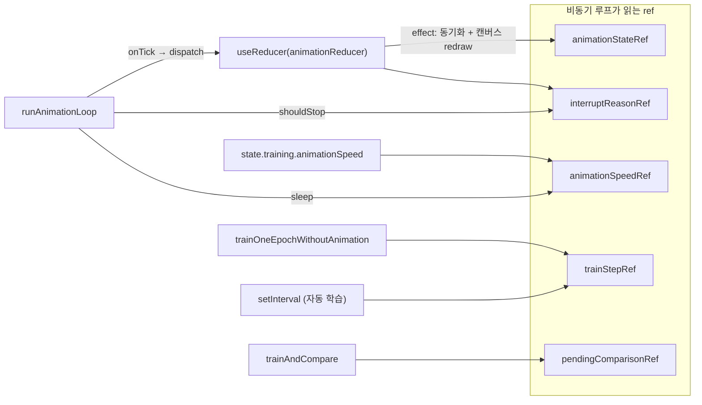
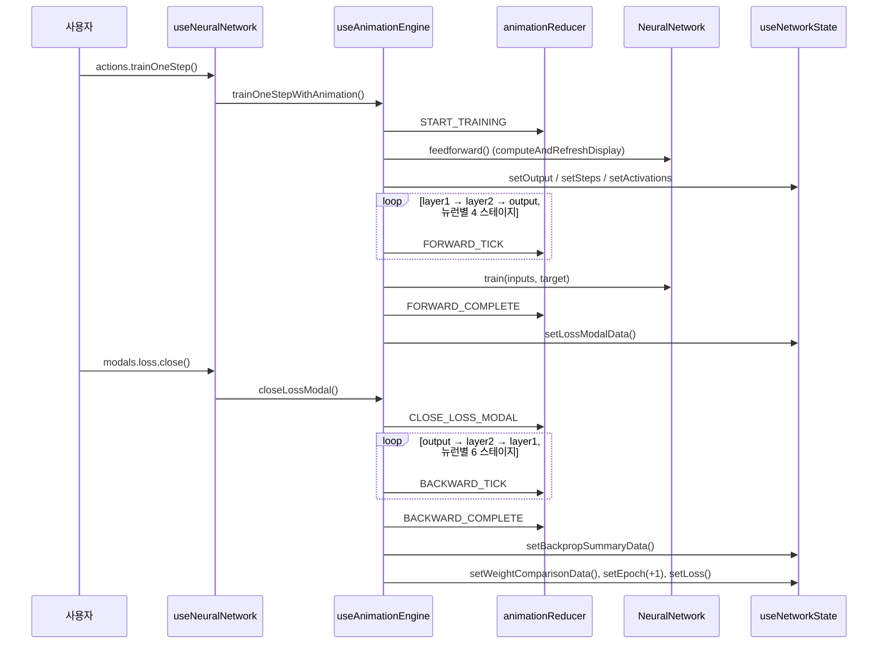

# Hook Architecture

`src/hooks/`는 세 개의 훅과 하나의 유틸리티 훅으로 구성됩니다.

## 훅 관계도

```mermaid
flowchart TB
    App["App.tsx"]

    subgraph Orchestrator
        useNN["useNeuralNetwork"]
        nnRef["nnRef: NeuralNetwork"]
        visRef["visualizerRef: Visualizer | null"]
    end

    useNS["useNetworkState<br/>React 상태"]
    useAE["useAnimationEngine<br/>FSM · 애니메이션 · 학습 · 클릭"]
    useModal["useModalState (×3)"]

    App --> useNN
    useNN --> nnRef
    useNN --> visRef
    useNN --> useNS
    useNN --> useAE
    useNS --> useModal
    useAE -. reads/writes .-> nnRef
    useAE -. reads .-> visRef
    useAE -. setters .-> useNS
```

## 각 훅의 책임

| 훅 | 책임 | 입력 |
|---|---|---|
| [useNetworkState](../src/hooks/useNetworkState.ts) | 입력값, 통계(epoch/loss/lr/output/steps), 학습 플래그, 히트맵 데이터, 모달 3개. 메모이즈된 setter 그룹과 `resetAllState` 제공 | 없음 |
| [useAnimationEngine](../src/hooks/useAnimationEngine.ts) | `useReducer(animationReducer)` 기반 FSM, 순전파/역전파 애니메이션 루프, 학습 제어(애니메이션 스텝·1 epoch·자동 학습·리셋), 모달 전이, 캔버스 클릭 처리 | `nnRef`, `visualizerRef`, `useNetworkState` 반환값 |
| [useNeuralNetwork](../src/hooks/useNeuralNetwork.ts) | ref 두 개를 소유하고 위 두 훅을 조합. `network`, `inputs`, `controls`, `stats`, `training`, `modals`, `visualizer`, `actions`로 그룹화된 메모이즈 API 반환 | 없음 |
| [useModalState](../src/hooks/useModalState.ts) | `show`, `data`, `open(data)`, `close()`, `setData(data)`. `close`는 data를 유지해 "다시 보기" 버튼이 동작하도록 함 | 없음 |

## useAnimationEngine 내부

```mermaid
flowchart LR
    subgraph Refs["비동기 루프가 읽는 ref"]
        asRef["animationStateRef"]
        irRef["interruptReasonRef"]
        spRef["animationSpeedRef"]
        tsRef["trainStepRef"]
        cmpRef["pendingComparisonRef"]
    end

    reducer["useReducer(animationReducer)"] -->|"effect: 동기화 + 캔버스 redraw"| asRef
    reducer --> irRef
    speed["state.training.animationSpeed"] --> spRef
    trainEpoch["trainOneEpochWithoutAnimation"] --> tsRef
    trainAndCompare --> cmpRef

    loop["runAnimationLoop"] -->|shouldStop| irRef
    loop -->|sleep| spRef
    loop -->|onTick → dispatch| reducer
    interval["setInterval (자동 학습)"] --> tsRef
```

### 설계 원칙

- **캔버스는 FSM 상태에서 파생된다.** `animationState`가 바뀌면 effect가 `refreshDisplayOnly()`를 호출한다. 액션을 dispatch한 뒤 수동으로 다시 그리지 않는다.
- **비동기 루프는 closure 대신 ref를 읽는다.** 속도 슬라이더, 일시정지, 자동 학습 콜백은 모두 ref를 통해 최신 값을 참조하므로 실행 중에 바꿔도 즉시 반영된다.
- **학습은 `trainAndCompare()` 한 곳에서만 일어난다.** 스냅샷 → `nn.train()` → 스냅샷 비교 결과를 `pendingComparisonRef`에 보관하고, 애니메이션 완료 또는 즉시 학습 시 `commitTrainingStats()`가 epoch/loss/비교 데이터를 React 상태로 올린다.
- **리셋은 새 `NeuralNetwork`를 만든다.** 현재 학습률을 생성자에 넘겨 UI와 네트워크의 학습률이 어긋나지 않게 한다.

## 데이터 흐름: 애니메이션 학습 1회

```mermaid
sequenceDiagram
    participant User as 사용자
    participant NN as useNeuralNetwork
    participant AE as useAnimationEngine
    participant FSM as animationReducer
    participant Net as NeuralNetwork
    participant State as useNetworkState

    User->>NN: actions.trainOneStep()
    NN->>AE: trainOneStepWithAnimation()
    AE->>FSM: START_TRAINING
    AE->>Net: feedforward() (computeAndRefreshDisplay)
    AE->>State: setOutput / setSteps / setActivations
    loop layer1 → layer2 → output, 뉴런별 4 스테이지
        AE->>FSM: FORWARD_TICK
    end
    AE->>Net: train(inputs, target)
    AE->>FSM: FORWARD_COMPLETE
    AE->>State: setLossModalData()

    User->>NN: modals.loss.close()
    NN->>AE: closeLossModal()
    AE->>FSM: CLOSE_LOSS_MODAL
    loop output → layer2 → layer1, 뉴런별 6 스테이지
        AE->>FSM: BACKWARD_TICK
    end
    AE->>FSM: BACKWARD_COMPLETE
    AE->>State: setBackpropSummaryData()
    AE->>State: setWeightComparisonData(), setEpoch(+1), setLoss()
```

## 캔버스 클릭

`handleCanvasClick(x, y)`는 `Visualizer.findNeuronAtPosition`으로 뉴런을 찾은 뒤

- 현재 애니메이션 중인 뉴런이면 다음 스테이지로 진행하고, 마지막 스테이지면 다음 뉴런으로 이동한다 (`advanceForwardStage` / `advanceBackwardStage`).
- 다른 뉴런이면 `JUMP_TO_NEURON`으로 이동한다. 이 액션은 `interruptReason = 'jumped'`를 설정해 실행 중인 루프를 멈추고, 시작 버튼(재개)으로 그 위치부터 다시 진행할 수 있다.
